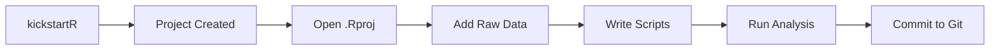

# kickstartR 

<!-- badges: start -->
[](https://github.com/sidhuk/kickstartR/actions/workflows/R-CMD-check.yaml)
[](https://CRAN.R-project.org/package=kickstartR)
[](https://lifecycle.r-lib.org/articles/stages.html#experimental)
<!-- badges: end -->

> **Stop wasting time setting up projects. Start analyzing.**

kickstartR creates production-ready R project structures in seconds. Choose from 5 templates, add renv for dependencies, targets for pipelines, and automatic LICENSE files - all with a single function call.

---

## Why kickstartR?

| Without kickstartR | With kickstartR |
|:---|:---|
| Manually create 10+ folders | One command creates everything |
| Copy .gitignore from old projects | Best-practice .gitignore included |
| Forget to set up renv | `include_renv = TRUE` and done |
| Inconsistent project structures | Same structure, every time |

---

## Installation

```r
# Install from GitHub
devtools::install_github("sidhuk/kickstartR")
```

---

## Quick Start

### 30 Seconds to Your First Project

```r
library(kickstartR)

# That's it. You're ready to analyze.
initialize_project("my_analysis")
```

### Or Use the Interactive Wizard

```r
# Guided setup - perfect for beginners
initialize_project_interactive()
```

```
=== kickstartR Project Setup Wizard ===

Project name: sales_analysis
Template [1-5]: 2 (analysis)
Author: Jane Doe
License: MIT
Initialize renv? y
Initialize git? y

Project created successfully!
```

---

## Templates

Choose the right structure for your work:

| Template | Best For | Command |
|:---------|:---------|:--------|
| **basic** | General data analysis | `template = "basic"` |
| **analysis** | Full research projects | `template = "analysis"` |
| **shiny** | Web applications | `template = "shiny"` |
| **targets** | Reproducible pipelines | `template = "targets"` |
| **minimal** | Quick scripts | `template = "minimal"` |

```r
# See all templates with descriptions
available_templates(verbose = TRUE)
```

### Template Structures

<details>
<summary><b>basic</b> - Standard Data Analysis</summary>

```
MyProject/
├── 01_data/
│   ├── 01_raw/
│   ├── 02_processed/
│   └── 03_external/
├── 02_scripts/
│   └── 00_main_script.R
├── 03_output/
│   ├── 01_figures/
│   ├── 02_tables/
│   └── 03_reports_rendered/
├── 04_models/
├── 05_notebooks/
├── README.md
├── .gitignore
└── MyProject.Rproj
```
</details>

<details>
<summary><b>shiny</b> - Web Application</summary>

```
MyShinyApp/
├── app.R
├── R/
│   ├── ui.R
│   └── server.R
├── www/
│   ├── css/
│   └── js/
├── data/
├── README.md
└── MyShinyApp.Rproj
```
</details>

<details>
<summary><b>targets</b> - Reproducible Pipeline</summary>

```
MyPipeline/
├── _targets.R
├── R/
│   └── functions.R
├── 01_data/
│   ├── 01_raw/
│   └── 02_processed/
├── 03_output/
├── README.md
└── MyPipeline.Rproj
```
</details>

---

## Features

### renv Integration

Lock your dependencies for reproducibility:

```r
initialize_project("reproducible_analysis", include_renv = TRUE)

# Creates renv.lock and renv/ folder automatically
# Other users can restore with: renv::restore()
```

### targets Pipeline Support

Build make-like pipelines for complex analyses:

```r
initialize_project("data_pipeline", template = "targets")

# Or add to any template:
initialize_project("my_project", include_targets = TRUE)
```

### Automatic License Generation

```r
initialize_project("open_source_project", license = "MIT", author = "Jane Doe")

# Available: MIT, GPL-3, GPL-2, CC-BY-4.0, CC0
available_licenses()
```

### Post-Creation Actions

```r
initialize_project(
  "quick_start",
  git_init = TRUE,      # Initialize git repository
  open_project = TRUE,  # Open in RStudio immediately
  open_readme = TRUE    # Start editing README right away
)
```

### Custom Directories

```r
initialize_project(
  "custom_project",
  custom_dirs = c("06_presentations", "07_literature", "08_admin"),
  gitignore_extras = c("*.docx", "private/")
)
```

---

## Full Example

```r
library(kickstartR)

# Create a fully-featured research project
initialize_project(
  project_name = "climate_analysis_2024",
  path = "~/Projects",
  template = "analysis",
  author = "Dr. Jane Smith",
  license = "CC-BY-4.0",
  include_renv = TRUE,
  include_targets = TRUE,
  git_init = TRUE,
  custom_dirs = c("06_presentations", "07_literature"),
  open_project = TRUE
)
```

**Result:**
```
Creating project: climate_analysis_2024
Created 2 custom directories
Added targets pipeline support
Created LICENSE file (CC-BY-4.0)
Initialized renv
Initialized git repository

Project 'climate_analysis_2024' created successfully!
Location: /Users/jane/Projects/climate_analysis_2024
```

---

## Team Configuration

Set defaults for your whole team with `.kickstartR.yml`:

```r
# Create a config template
create_config(global = TRUE)  # In home directory
```

```yaml
# ~/.kickstartR.yml
defaults:
  template: analysis
  include_renv: true
  license: MIT
  git_init: true

author:
  name: "Data Science Team"
  email: "team@company.com"

custom_dirs:
  - "06_documentation"
```

---

## Function Reference

| Function | Description |
|:---------|:------------|
| `initialize_project()` | Create a new project with specified options |
| `initialize_project_interactive()` | Guided wizard for project creation |
| `available_templates()` | List available project templates |
| `available_licenses()` | List available license types |
| `create_config()` | Create a .kickstartR.yml config file |

---

## Recommended Workflow



1. **Create**: `initialize_project("my_project", include_renv = TRUE)`
2. **Open**: Double-click the `.Rproj` file
3. **Add data**: Place files in `01_data/01_raw/`
4. **Analyze**: Edit scripts in `02_scripts/`
5. **Output**: Save results to `03_output/`
6. **Share**: Push to GitHub with confidence

---

## Works Great With

| Package | Integration |
|:--------|:------------|
| [renv](https://rstudio.github.io/renv/) | `include_renv = TRUE` |
| [targets](https://docs.ropensci.org/targets/) | `template = "targets"` or `include_targets = TRUE` |
| [here](https://here.r-lib.org/) | `.here` file created automatically |
| [usethis](https://usethis.r-lib.org/) | Complementary project setup tools |

---

## Contributing

We welcome contributions! Please feel free to:

- Report bugs via [GitHub Issues](https://github.com/sidhuk/kickstartR/issues)
- Suggest features or new templates
- Submit pull requests

---
## License

MIT License - see [LICENSE](LICENSE) for details.

---

<p align="center">
  <b>Made with passion for the R community</b><br>
  <a href="https://github.com/sidhuk/kickstartR">GitHub</a> ·
  <a href="https://sidhuk.github.io/kickstartR/">Documentation</a>
</p>
