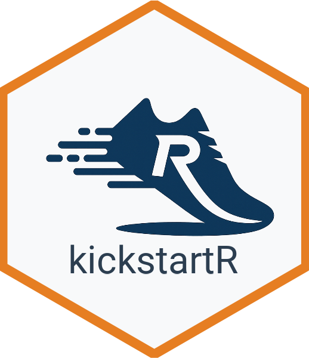

# kickstartR 

> Create Project Boilerplate Structures for R Analysis Projects

## Overview

`kickstartR` is an R package that helps you quickly initialize new R analysis projects with a standardized, organized directory structure and boilerplate files. It creates a consistent project layout that follows best practices for data science and statistical analysis projects.

## Features

- **Standardized Directory Structure**: Creates organized folders for data, scripts, outputs, models, and notebooks
- **Boilerplate Files**: Generates template files including README.md, .gitignore, and starter R scripts
- **RStudio Integration**: Creates .Rproj files for seamless RStudio integration
- **Flexible Configuration**: Customizable options for including/excluding specific folders
- **Best Practices**: Follows R community best practices for project organization

## Installation

You can install the development version of kickstartR from GitHub:

```r
# Install devtools if you haven't already
install.packages("devtools")

# Install kickstartR from GitHub
devtools::install_github("sidhuk/kickstartR")
```

## Quick Start

```r
library(kickstartR)

# Create a new project in the current directory
initialize_project("MyAnalysisProject")

# Create a project in a specific location
initialize_project("MyProject", path = "~/Documents/R_Projects")

# Customize the project structure
initialize_project("MyProject",
                   include_models = FALSE,
                   include_notebooks = FALSE,
                   create_rproj = TRUE)
```

## Project Structure

When you run `initialize_project()`, it creates the following directory structure:

```
MyProject/
├── 01_data/
│   ├── 01_raw/           # Original, immutable data
│   ├── 02_processed/     # Cleaned, transformed data
│   └── 03_external/      # External data sources
├── 02_scripts/           # R scripts and analysis code
│   └── 00_main_script.R  # Main analysis script template
├── 03_output/            # All analysis outputs
│   ├── 01_figures/       # Generated plots and figures
│   ├── 02_tables/        # Generated tables and summaries
│   └── 03_reports_rendered/ # Rendered reports (HTML, PDF)
├── 04_models/            # Saved model objects (optional)
├── 05_notebooks/         # R Markdown, Jupyter notebooks (optional)
├── README.md             # Project documentation
├── .gitignore            # Git ignore rules
├── .here                 # For use with the 'here' package
└── MyProject.Rproj       # RStudio project file
```

## Function Reference

### `initialize_project()`

Creates a new project with standardized directory structure and boilerplate files.

**Parameters:**

- `project_name`: Name of the project (required)
- `path`: Directory where project should be created (default: current directory)
- `overwrite`: Whether to overwrite existing directories (default: FALSE)
- `create_rproj`: Whether to create RStudio project file (default: TRUE)
- `include_models`: Whether to include models folder (default: TRUE)
- `include_notebooks`: Whether to include notebooks folder (default: TRUE)

**Examples:**

```r
# Basic usage
initialize_project("MyProject")

# Advanced usage with custom options
initialize_project(
  project_name = "DataAnalysis2024",
  path = "~/Projects",
  include_models = TRUE,
  include_notebooks = FALSE,
  create_rproj = TRUE
)

# Overwrite existing project (use with caution!)
initialize_project("ExistingProject", overwrite = TRUE)
```

## Best Practices

The project structure created by `kickstartR` follows these best practices:

1. **Separate raw and processed data**: Keep original data immutable in `01_data/01_raw/`
2. **Organize outputs**: Separate figures, tables, and reports for easy navigation
3. **Use relative paths**: The `.here` file enables robust path management with the `here` package
4. **Version control ready**: Includes sensible `.gitignore` patterns for R projects
5. **Reproducible workflows**: Template scripts include best practice patterns

## Recommended Workflow

1. Create your project: `initialize_project("MyProject")`
2. Open the `.Rproj` file in RStudio
3. Place raw data in `01_data/01_raw/`
4. Start coding in `02_scripts/00_main_script.R`
5. Save processed data to `01_data/02_processed/`
6. Export outputs to appropriate folders in `03_output/`

## Dependencies

`kickstartR` has minimal dependencies and uses only base R functions. For enhanced functionality, consider installing:

- `here`: For robust file path management
- `usethis`: For additional project setup utilities
- `renv`: For package dependency management

## Contributing

Contributions are welcome! Please feel free to submit issues, feature requests, or pull requests at https://github.com/sidhuk/kickstartR.

## License

This project is licensed under the MIT License - see the LICENSE file for details.
